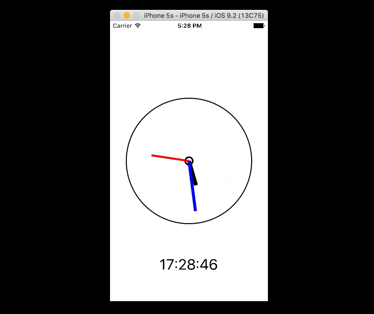

# Tokei
Simple clock app with CALayer and adaptive layout. It has different styles based on device orientation.

## Knowledge
- Create adaptive design using sizeClass on storyboard.
- Set proper layout constants dinamically for all ios devices and iPad devices
- Understand how to work with CALayer
- Understand IBDesignable and IBInspectable
- Create clockwise trnasition on a layer instance

## Demo

## TODO
- [x] Make the height of the hands dinamically depending on the clock face size
- [x] Add didital watch under anolog one.
- [x] Add autolayout constraint for iphone and ipad in landscape and portrait mode.
- [x] When the app is in landscape mode, relayout the views.
- [ ] Add time on clock face view using CATextLayer
